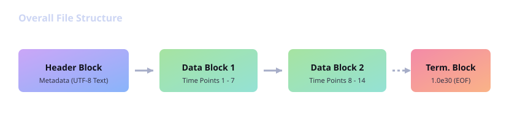
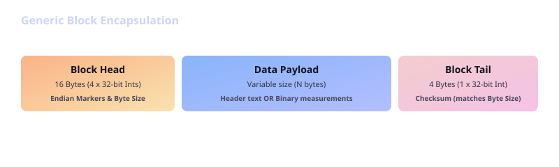
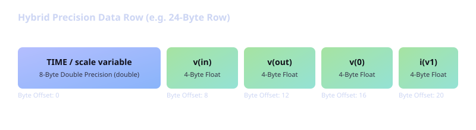

# Synopsys HSPICE Binary Format Reference Manual

This document provides a comprehensive technical reference for the Synopsys HSPICE post-processor binary database format (generated via `.options post=1`). It details the file-level block chaining, block-level encapsulation headers, header-block metadata, and data-block hybrid precision record layout.

---

## 1. File-Level Layout

An HSPICE binary output database (such as `.tr0`, `.ac0`, or `.sw0` files) is structured as a contiguous sequence of self-describing **blocks**. Every file begins with exactly one **Header Block** (containing text-based metadata) followed by one or more **Data Blocks** containing the simulation records.



---

## 2. Block-Level Structure

Each individual block is encapsulated in a wrapper consisting of a **16-byte Block Head**, a variable-size **Data Payload**, and a **4-byte Block Tail**.



### 2.1 The Block Head (16 Bytes)
The block head consists of four 32-bit integers (`int`):
1.  **Endian Marker 1** (Offset `0`): Constant `0x00000004` (in file endianness).
2.  **Unused / Record Count** (Offset `4`): Typically `1` or unused.
3.  **Endian Marker 2** (Offset `8`): Constant `0x00000004` (in file endianness).
4.  **Payload Size** (Offset `12`): 32-bit integer indicating the exact size in bytes of the **Data Payload** section.

#### Endianness Determination
During file loading, a parser reads the block head. By comparing the byte ordering of Endian Marker 1:
*   If bytes read are `04 00 00 00` (value `4` in little-endian), the file matches the current standard little-endian host architecture (`swap = 0`).
*   If bytes read are `00 00 00 04` (value `4` in big-endian), byte-swapping must be performed on all subsequent integers, floats, and doubles read from the file (`swap = 1`).

### 2.2 The Block Tail (4 Bytes)
The block tail consists of a single 32-bit integer representing the size in bytes of the preceding Data Payload section. It acts as a trailing verification checksum. If this value does not match the Payload Size in the Block Head, the file block is considered corrupted.

---

## 3. The Header Block Payload

The payload of the very first block in the file contains plain text metadata (no newlines, pad spaces are used to maintain column alignment) and ends with the token `$&%#`.

### 3.1 Format Descriptor String (First 20 or 24 characters)
The very first characters of the Header Block form a fixed format descriptor string:
*   **Legacy Format Version (`9601`)**: 20 characters total:
    *   `0..3`: Number of monitored variables (e.g., `0005`, including scale variable).
    *   `4..7`: Number of monitored probes (`parsedProbes`).
    *   `8..11`: Number of sweep dimensions/parameters (`numOfSweeps`). `0000` means no sweep; `0001` means one swept dimension.
    *   `12..15`: Padding zeros (`0000`).
    *   `16..19`: Format version identifier string (`9601`).
*   **Modern Format Versions (`2001`, `2013`)**: 24 characters total:
    *   `0..3`: Number of monitored variables (e.g., `0005`, including scale variable).
    *   `4..7`: Number of monitored probes (`parsedProbes`).
    *   `8..11`: Number of sweep dimensions/parameters (`numOfSweeps`). `0000` means no sweep; `0001` means one swept dimension.
    *   `12..19`: Padding zeros (`00000000`).
    *   `20..23`: Format version identifier string (`2001` or `2013`).

### 3.2 Metadata Fields
Following the format descriptor, fixed character offsets define simulation properties. All offsets are relative to the start of the Header Block payload:

| Offset (chars) | Length | Field |
|---|---|---|
| `0` | `4` | Number of variables (including scale) |
| `4` | `4` | Number of probes |
| `8` | `4` | Number of sweep dimensions (`0` or `1`) |
| `24` | `64` | Simulation title string |
| `88` | `24` | Creation date/time string |
| `187` | `~16` | Number of swept points (`sweepSize`); space-delimited integer. Valid for **all** format versions. |
| `256` | variable | Variable type codes and names (space-delimited tokens, see §3.3) |

*   **Variable Types**: The physical quantity type code of each variable:
    *   `1`: Voltage or standard MNA variable.
    *   `2`: Frequency or AC sweep variable (signals that the analysis is AC and circuit variables are complex).
    *   `3`: Parameter sweep variable (e.g., swept source voltage `VOLTS` or resistance parameter `rval`).
    *   `4`: Swept current source variable (e.g., `AMPS`).
    *   `8`: Current probe or time/scale variable.
    *   *Note: These codes represent physical quantities, not byte sizes.*
*   **Variable Names**: Space-separated names of the variables (e.g., `TIME`, `v(in)`, `v(out)`, `i(vinput)`).
*   **Termination Marker**: The header block data payload ends with the characters `$&%#`.

> [!NOTE]
> **Probe vs Variable Counts**: In some HSPICE configurations (such as combined probe + parameter sweep simulations, or standard sweep simulations), all monitored vectors are counted under `numVariables` with `numProbes` set to `0`. Parsers should always compute the total number of vectors in the file as $N = \text{numVariables} + \text{numProbes}$.

### 3.3 Variable Type and Name Token Layout
Starting at payload offset `256`, the space-delimited token sequence is:

```
<type_0> <type_1> ... <type_{N-1}>  <name_0> <name_1> ... <name_{N-1}>
```

where `N = numVariables + numProbes` (total vectors), index `0` is the scale/independent variable, and indices `1..N-1` are the circuit variables. Types and names are in strict natural index order — `type_i` always corresponds to `name_i`.

---

## 4. The Data Block Payload & Record Layout

HSPICE writes simulation data points in a **Hybrid Precision Record Layout**.



### 4.1 Hybrid Precision Record Details

Variable storage sizes depend on the format version and analysis type:

| Variable | `9601` (legacy) | `2001` | `2013` |
|---|---|---|---|
| Scale (index 0, real) | 4-byte `float` | 8-byte `double` | 8-byte `double` |
| Circuit variable, real (DC/Tran) | 4-byte `float` | 8-byte `double` | 4-byte `float` |
| Circuit variable, complex (AC) | 4-byte `float` × 2 (re+im) | 8-byte `double` × 2 (re+im) | 4-byte `float` × 2 (re+im) |

*   **Scale Variable**: The first variable in each record is the abscissa (`TIME` for transient, `HERTZ` for AC, or the swept source value for DC).
*   **Circuit Variables**: All other signals (node voltages, branch currents, device probes).
*   **Row Size Calculation**:

    $$\text{Row Size (Bytes)} = \text{Size}(\text{scale}) + \sum_{j=1}^{M} \text{Size}(\text{circuit variable } j)$$

    #### DC & Transient Examples
    For a transient simulation with 3 circuit variables in **2013** format:
    $$\text{Row Size} = 8 \text{ (TIME double)} + 3 \times 4 \text{ (float)} = 20 \text{ bytes}$$

    For the same simulation in **2001** format:
    $$\text{Row Size} = 8 \text{ (TIME double)} + 3 \times 8 \text{ (double)} = 32 \text{ bytes}$$

    For the same simulation in **9601** format:
    $$\text{Row Size} = 4 \text{ (TIME float)} + 3 \times 4 \text{ (float)} = 16 \text{ bytes}$$

    #### AC Example
    For an AC simulation with 3 circuit variables in **2013** format:
    $$\text{Row Size} = 8 \text{ (HERTZ double)} + 3 \times 8 \text{ (complex float)} = 32 \text{ bytes}$$

    For the same in **2001** format:
    $$\text{Row Size} = 8 \text{ (HERTZ double)} + 3 \times 16 \text{ (complex double)} = 56 \text{ bytes}$$

### 4.2 Swept Simulations & Sweep Values

If a simulation includes parameter sweeps (`numOfSweeps > 0`):
1. The simulation data is partitioned into separate **sweep tables**, one per swept point value. The number of tables equals `sweepSize` read from header offset `187`.
2. Each sweep table begins with the **sweep value** (e.g., temperature, source voltage, or parameter value):
   - **`2013`, `9601`, `9007` formats**: stored as a **4-byte single-precision float**.
   - **`2001` format**: stored as an **8-byte double-precision float** (consistent with its all-double data layout).
3. Following the sweep value, the standard hybrid precision data rows are written consecutively until the sweep table termination block (see §4.3).

### 4.3 Sweep Table Termination & Block Chaining

> **Key finding**: The termination marker is **not** embedded inside a data payload. It is written as a **dedicated, standalone block** whose entire payload is the marker value. This block immediately follows the last data block of each sweep table.

The termination marker block per format:

| Format | Payload size | Payload content | Value |
|---|---|---|---|
| `2013` | 8 bytes | IEEE 754 double | `1.0e30` |
| `2001` | 8 bytes | IEEE 754 double | `1.0e30` |
| `9601` / `9007` | 4 bytes | IEEE 754 float  | `1.0e30` |

**Parsing algorithm**:
1. Read data blocks sequentially, accumulating payload bytes into the current sweep table buffer.
2. After reading each block, check if the block is a termination block:
   - For `2013`/`2001`: block payload size is 8 and the value interpreted as a `double` is `> 9e29`.
   - For `9601`/`9007`: block payload size is 4 and the value interpreted as a `float` is `> 9e29`.
3. If a termination block is detected, close the current sweep table and start accumulating a new one.
4. Repeat until EOF. The number of closed tables must equal `sweepSize`.
5. For un-swept simulations (`numOfSweeps = 0`, `sweepSize = 1`), the single table is closed by the same termination block mechanism.

